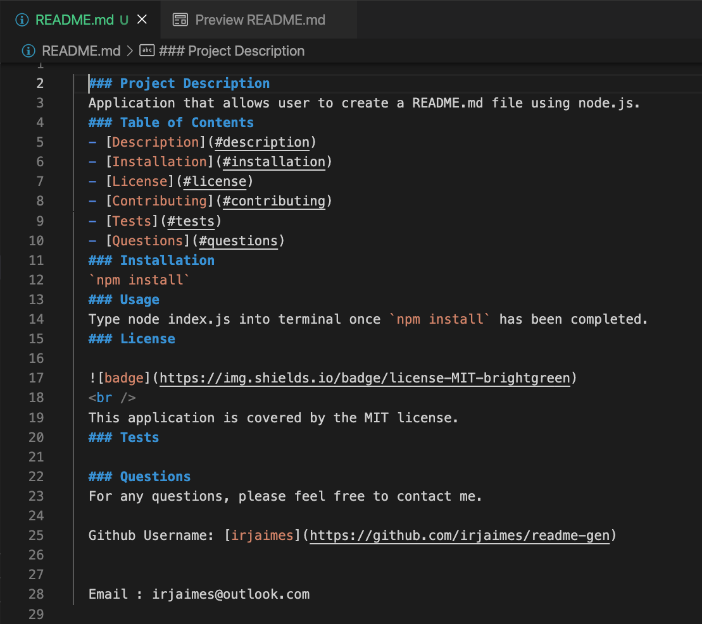

 
  ### Project Description
  Application that allows user to create a README.md file using node.js.
  ### Table of Contents 
  - [Description](#description)
  - [Installation](#installation)
  - [License](#license)
  - [Contributing](#contributing)
  - [Tests](#tests)
  - [Questions](#questions)
  ### Installation 
  `npm install`
  ### Usage
  Type node index.js into terminal once `npm install` has been completed.

  ### Walkthrough [Video](https://drive.google.com/file/d/15BLhLQ9JEIPLfdUkyRoc5Ti1bRFgaFSr/view)
 
  ### Sample Readme
  
  ### License 
  
  
   
  This application is covered by the MIT license. 
  ### Tests
  
  ### Questions 
  For any questions, please feel free to contact me.
  
  Github Username: [irjaimes](https://github.com/irjaimes/readme-gen)

  
  Email : irjaimes@outlook.com
